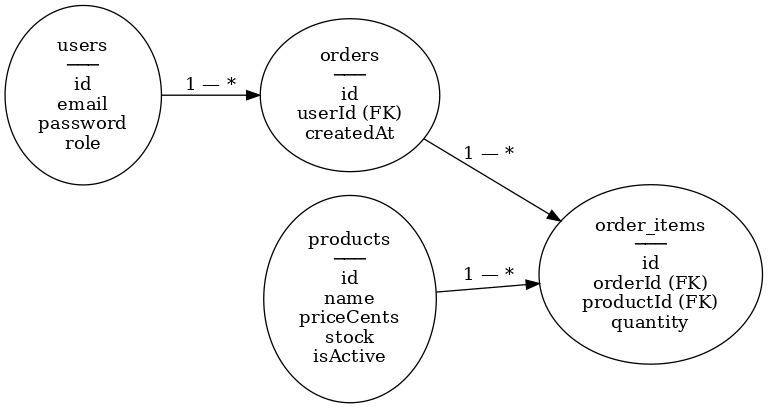
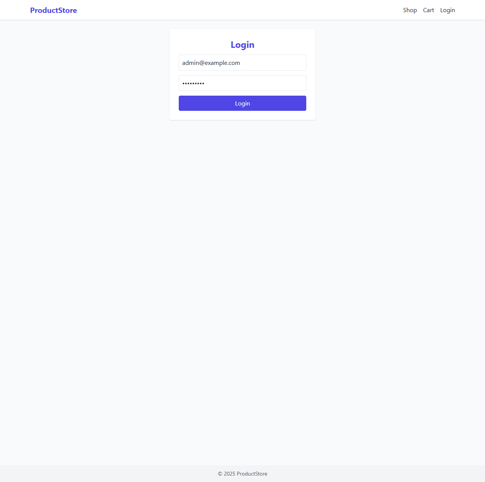
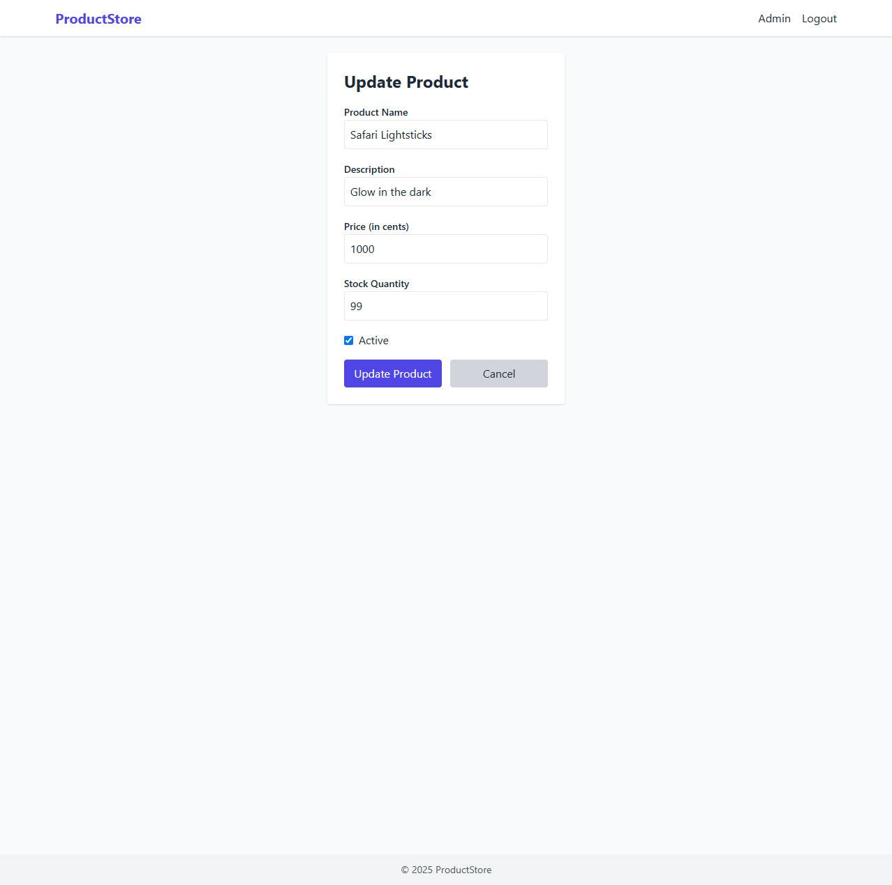
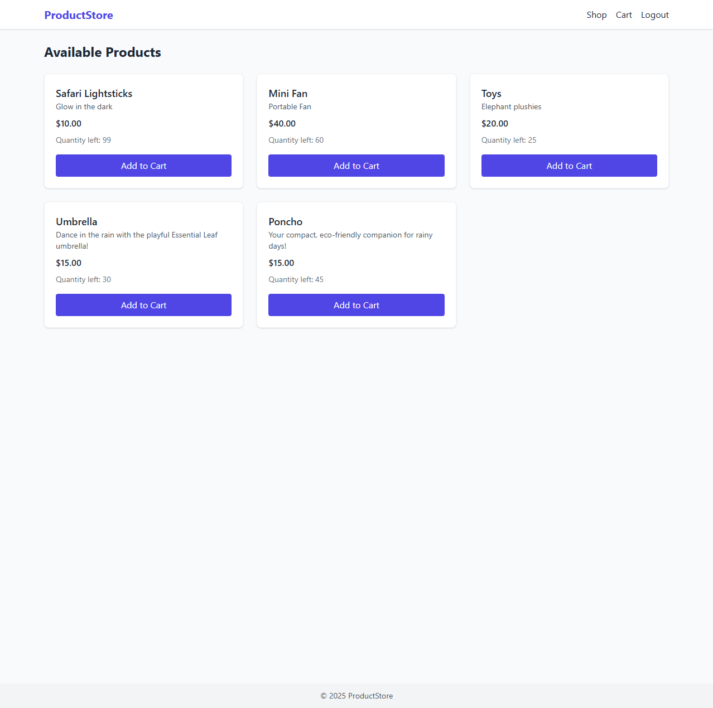
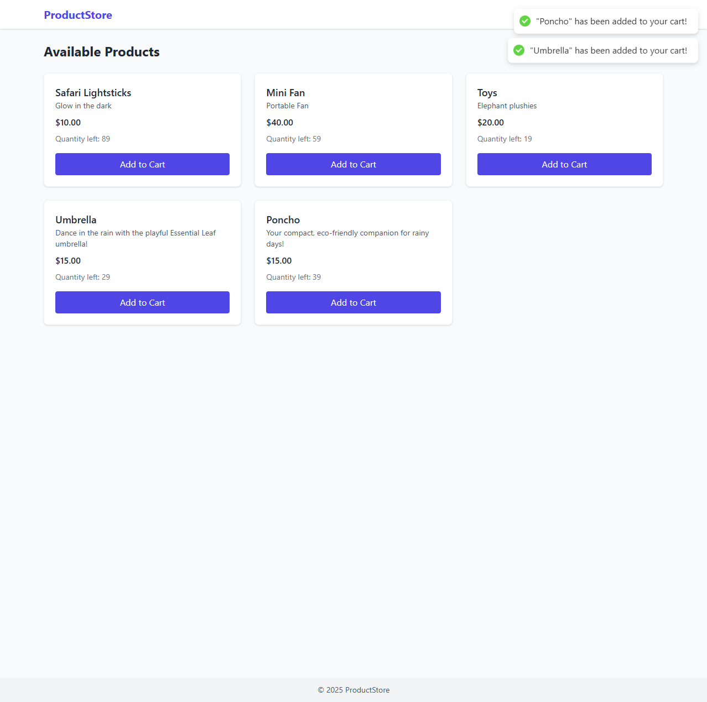
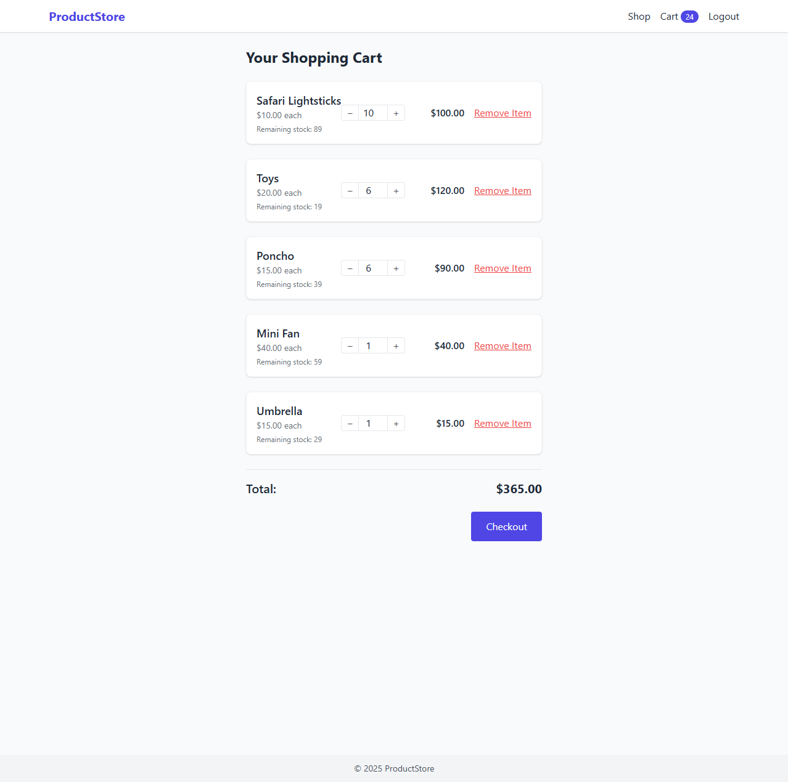

# 🛍️ Product Management Application

A full-stack demo built with **NestJS + MikroORM + PostgreSQL + React + TailwindCSS**.

---

## 📘 Overview

This application allows:

- 👨‍💼 **Admins:** manage products (Create, Read, Update, Delete)
- 🛒 **Users:** browse products, add to cart, and checkout orders

---

## 🧱 Tech Stack

| Layer                | Technology                                  |
| -------------------- | ------------------------------------------- |
| **Frontend**         | React, TypeScript, TailwindCSS, React Query |
| **Backend**          | NestJS, MikroORM, JWT Authentication        |
| **Database**         | PostgreSQL (via Docker)                     |
| **ORM**              | MikroORM                                    |
| **State Management** | Zustand                                     |
| **API Docs**         | Swagger (http://localhost:3000/docs)        |

---

## ⚙️ Setup Guide

### 🐋 1. Start Database

docker compose up -d  

### 🖥️ 2. Backend Setup

cd server  
cp .env.example .env  
npm install  
npm run mig:up  
npm run seed  
npm run start:dev  

### 💻 3. Frontend Setup

cd web  
cp .env.example .env  
npm install  
npm run dev  

## 🚀 Features

### 🧩 Admin

- Add, update, and delete products
- View current stock and product catalog
- Automatic delisting when stock reaches zero

### 🛍️ User

- Browse available products
- Add to cart and adjust item quantities dynamically
- View remaining stock in real time
- Checkout to trigger automatic stock updates

### 🔐 Authentication

- JWT-based login
- Admin and User roles with distinct access rights
- Admin access hides user navigation (Shop / Cart)

## 🧾 API Endpoints (Highlights)

| Method   | Endpoint           | Description                    |
| -------- | ------------------ | ------------------------------ |
| `POST`   | `/auth/login`      | User/Admin login               |
| `GET`    | `/products`        | Get all available products     |
| `POST`   | `/products`        | Add a new product (Admin only) |
| `PATCH`  | `/products/:id`    | Update a product (Admin only)  |
| `DELETE` | `/products/:id`    | Remove a product (Admin only)  |
| `POST`   | `/orders/checkout` | Checkout cart and update stock |

## 📄 Documentation

### 1️⃣ API Documentation

- Auto-generated Swagger UI available at:  
  👉 http://localhost:3000/docs
- Displays all endpoints, DTOs, and authentication details for testing.

### 2️⃣ Code Documentation

- Each service, controller, and entity contains JSDoc-style comments for maintainability.
- Inline comments provided in key logic sections (e.g., checkout flow, authentication guard).
- Folder structure:  
  server/
  ├─ src/
  │ ├─ auth/
  │ ├─ products/
  │ ├─ orders/
  │ ├─ entities/
  │ └─ ...

### 3️⃣ Testing

- Unit Testing: Uses Jest for controllers and services.
- Run tests with:  
  npm run test
- Integration Testing: Example test cases provided for /products endpoints.

## 🗄️ Database Schema

### Entity Relationships

- User 1 — \* Order
- Order 1 — \* OrderItem
- Product 1 — \* OrderItem

### Tables

| Table           | Key Fields                            | Description                    |
| --------------- | ------------------------------------- | ------------------------------ |
| **users**       | id, email, password, role             | Stores admin and user accounts |
| **products**    | id, name, priceCents, stock, isActive | Product catalog                |
| **orders**      | id, userId, createdAt                 | Checkout records               |
| **order_items** | id, orderId, productId, quantity      | Line items in each order       |

## 🧭 ER Diagram

## 🧠 Notes

- Ensure Docker is running before starting the backend.
- Default ports:  
  - Backend → http://localhost:3000
  - Frontend → http://localhost:5173
- Update .env files in both server and web folders if ports or DB configs differ.

## 🧑‍💻 Developer Info

Built with ❤️ using:

- TypeScript
- NestJS CLI
- React + Vite
- TailwindCSS
- PostgreSQL
- MikroORM

---

## 🖼️ Application Walkthrough

### 🧩 1️⃣ Admin Journey

#### 🔐 Admin Login

The admin logs in using their credentials at **`/login`** to manage the product catalog.

---

#### ➕ Add New Product

After logging in, the admin navigates to **Add New Product**.  
They can specify product name, description, price, and stock quantity.  
When saved, the product is added to the catalog and instantly visible to users.

---

#### ✏️ Update Product Stock

When a product’s quantity changes, the admin can **update stock quantity** directly from the dashboard.  
The change reflects instantly on the user-facing product page.

---

### 🛍️ 2️⃣ User Journey

#### 🔐 User Login

A user logs in with their own account at **`/login`**, which redirects them to the **Shop** page.

---

#### 🛒 Browse Products

Users can view all available products, each showing name, description, price, and **remaining stock**.  
Only active and in-stock products are displayed.

---

#### 🛍️ Add to Cart

Users add items to their cart, receiving an on-screen confirmation.  
The cart counter updates dynamically as items are added.

---

#### 🧾 Shopping Cart

The **Cart Page** displays all selected items, with adjustable quantities and automatic total recalculation.  
Users can remove items or proceed to checkout.

---

#### 💳 Checkout

Upon checkout, users receive a confirmation message —  
their order has been processed, and stock levels update automatically.

---

## 🧠 Summary

This walkthrough demonstrates:

- ✅ Secure login for both Admin and User roles
- ✅ Admin-managed product catalog
- ✅ Real-time stock tracking
- ✅ User-friendly shopping flow (add, update, remove, checkout)
- ✅ Dynamic frontend updates synced with backend database

---
